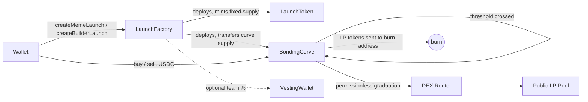

# Parabola

A USDC-native token launchpad for [Arc](https://docs.arc.network) (Circle's L1, mainnet September 16, 2026) — meme and builder-project tokens trade on a bonding curve and graduate permissionlessly to a public DEX pool once they earn real liquidity. No presale, no admin key in the loop, no custody.

Built as a **template you deploy yourself**, not a hosted product — you run the contracts, you run the frontend, you hold the keys.

---

## Why this exists / how it compares

You asked for this to be built with `ponsfamily.com` as a reference point, not a fork. Pons ("Pons Family") is a real, substantial launchpad on Robinhood Chain — CREATE2 token factory, a constant-product bonding curve, atomic creator buys, graduation into a locked Uniswap position, and a creator-tax fee model. Parabola borrows the same well-established *category* of mechanism (these are industry-standard DeFi patterns, not Pons' proprietary code) but is built specifically around what's different about Arc:

| | Pons (Robinhood Chain) | Parabola (Arc) |
|---|---|---|
| Quote currency | ETH-equivalent (volatile) | USDC — Arc's native gas token itself |
| Decimals | 18 | **6** (see the decimals gotcha below) |
| Launch tracks | Single track | Meme (100% fair launch) **and** Builder (capped, vested team allocation) |
| Graduation venue | Uniswap V3 → V4 | Configurable V2-style router (Arc's DEX addresses aren't public until mainnet — see below) |
| Fee model | Creator tax + buyback vault + platform token | Protocol + creator fee split, no separate platform token (kept out of scope — see Roadmap) |

No code, copy, or design assets were copied from Pons — this is an original implementation of generic, widely-published bonding-curve and token-factory patterns.

## Architecture



- **LaunchFactory** — creates launches, holds only non-custodial platform config (fee %, treasury, DEX router, pause switch). Cannot touch a live launch's funds. See `contracts/contracts/LaunchFactory.sol`.
- **BondingCurve** — one per launch. Constant-product pricing, permissionless graduation, launch-window anti-snipe cap. See `contracts/contracts/BondingCurve.sol`.
- **LaunchToken** — fixed-supply ERC20, no owner, no mint, no hooks, ever.

Full trust-model writeup, findings, and test coverage: **[SECURITY.md](./SECURITY.md)**.

## Repository layout

```
/                     Next.js 16 frontend (deploy this to Vercel)
  app/                Pages: landing, /explore, /launch, /token/[address], /how-it-works
  components/         UI components (wallet connect, trade panel, charts, forms)
  lib/                Chain config, contract ABIs/addresses, formatting, data hooks
/contracts            Hardhat workspace — Solidity contracts, tests, deploy script
  contracts/          LaunchFactory.sol, BondingCurve.sol, LaunchToken.sol, mocks/
  test/               21 tests — reentrancy, graduation, fees, access control, etc.
  scripts/deploy.ts   Deploys LaunchFactory to Arc testnet or mainnet
```

## Quick start

### 1. Deploy the contracts

```bash
cd contracts
npm install
cp .env.example .env   # fill in DEPLOYER_PRIVATE_KEY and TREASURY_ADDRESS
npm test                # optional — re-run the 21-test suite yourself first
npm run deploy:testnet  # or deploy:mainnet once Arc mainnet is live
```

Note the printed `LaunchFactory deployed: 0x...` address.

> **A note on how these were compiled.** Hardhat's own compiler downloader needs `binaries.soliditylang.org`, which may be blocked in some sandboxed/CI network setups (it was, in the environment this was built in). If `npx hardhat compile` fails for the same reason, `node scripts/compile-with-solcjs.js` compiles the exact same sources with the official `solc` npm package instead and writes artifacts Hardhat can still test against via `hardhat test --no-compile`. On a normal machine or CI runner with unrestricted network access, plain `npx hardhat compile` will work fine too.

### 2. Configure the frontend

```bash
cp .env.example .env.local
# set NEXT_PUBLIC_FACTORY_ADDRESS to the address from step 1
npm install
npm run dev   # http://localhost:3000
```

### 3. Deploy the frontend to Vercel

Push this repo to GitHub (or GitLab/Bitbucket), then in Vercel: **New Project → import the repo → add the environment variables from `.env.example` → Deploy.** No build configuration needed — it's a standard Next.js app. The `/contracts` directory has its own `package.json` and is ignored by Vercel's build automatically.

## Switching from testnet to mainnet

This was built before Arc's mainnet launch, so it defaults to Arc Testnet end-to-end (see the in-app testnet banner and the faucet link to `faucet.circle.com`). Once mainnet is live:

1. Verify the real chain ID / RPC / explorer at <https://docs.arc.network> and update `lib/chains.ts` (or the matching `NEXT_PUBLIC_ARC_MAINNET_*` env vars) if they differ from the placeholders in there.
2. `cd contracts && npm run deploy:mainnet` with a funded mainnet deployer key.
3. Once Arc's DEX ecosystem confirms router/factory addresses, call `LaunchFactory.setDexConfig(router, dexFactory)` from the owner account.
4. In Vercel: set `NEXT_PUBLIC_USE_MAINNET=true` and `NEXT_PUBLIC_FACTORY_ADDRESS` to the new address, redeploy.

That's the whole switch — nothing else in the codebase is testnet-specific.

## The two Arc gotchas this codebase was built around

1. **USDC has 6 decimals, not 18.** Arc's native gas token *is* USDC, at USDC's real-world 6-decimal convention — not the 18 decimals almost every other EVM chain's native currency uses. Every default constant in `LaunchFactory.sol` (e.g. `3_000e6` for the default virtual reserve) and every `formatUnits`/`parseUnits` call in `lib/format.ts` is written for 6 decimals deliberately. One source (`docs.arc.network`'s own MetaMask setup snippet) disagreed with this and said 18 — real USDC has always been 6 decimals everywhere it's deployed, and a second independent source (GetBlock's integration docs) explicitly names 18-decimals-assumed as "the single most common integration mistake" porting dApps to Arc, so 6 was treated as correct. **Verify this yourself against a funded testnet wallet before mainnet** — see SECURITY.md.
2. **Exact mainnet chain ID/RPC/DEX addresses aren't public yet.** This was written in the days before the September 16 mainnet launch. Testnet chain ID `5042002` is confirmed across five independent sources including Circle's own `arc-node` GitHub repo. Mainnet chain ID `5042` is the most consistent figure available pre-launch but is a single-source inference, not independently confirmed — `lib/chains.ts` and `hardhat.config.ts` both flag this in comments at the exact line to check.

## Tech stack

Next.js 16 (App Router, Turbopack) · React 19 · TypeScript (strict) · Tailwind CSS · wagmi v2 / viem · Solidity 0.8.24 · OpenZeppelin Contracts v5 · Hardhat

## Roadmap / deliberately out of scope for v1

- **Native Uniswap v4 graduation.** Arc's confirmed day-one DEX set includes Uniswap v4, which doesn't speak the V2-style router interface this MVP graduates into. A v4 hook-based adapter is a materially larger, separate piece of work — see SECURITY.md for what that needs.
- **Subgraph / indexer.** `LaunchFactory.getLaunches()` is a fine, zero-infrastructure way to list launches at MVP scale; it won't scale to thousands of tokens. Arc is confirmed to support The Graph.
- **Metadata upload/pinning.** The launch form takes a metadata URI directly rather than uploading+pinning an image for you — wire in a service like web3.storage or Pinata if you want that in-app.
- **A separate platform governance/revenue token** (Pons has one — `$PONS`, with burns and buybacks). Deliberately left out to keep the audited surface area small; the fee split between protocol and creator already exists without it.

## License

MIT. See individual file headers.
